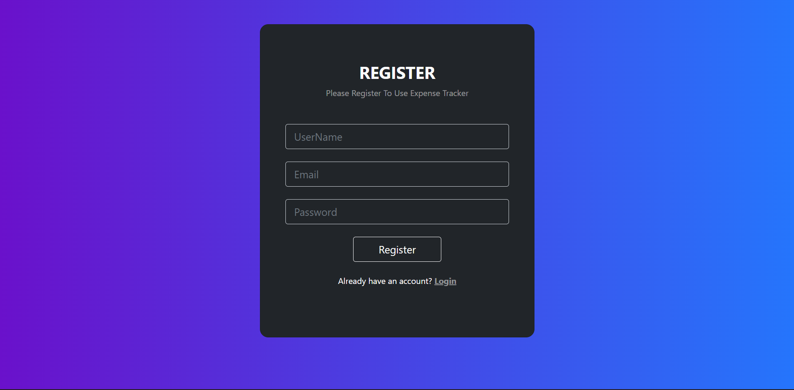
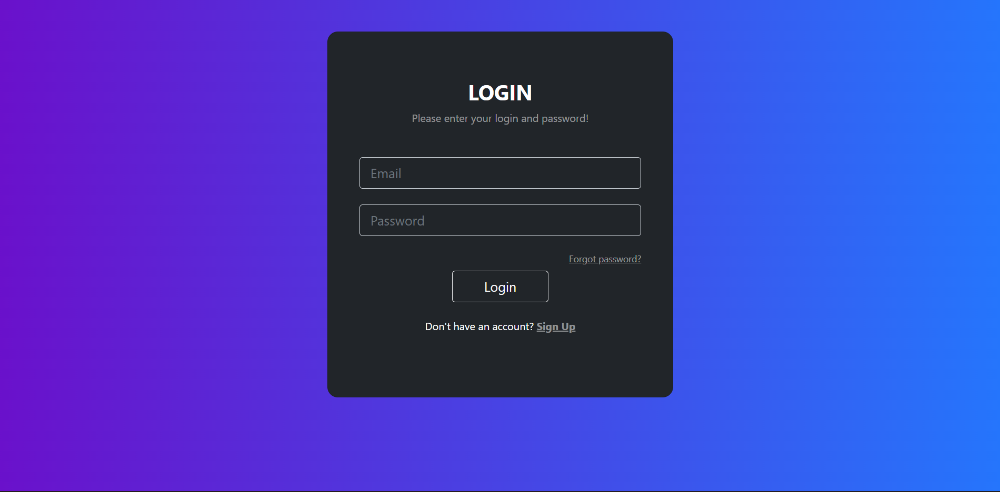
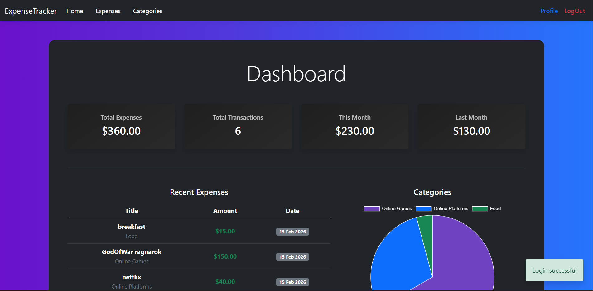
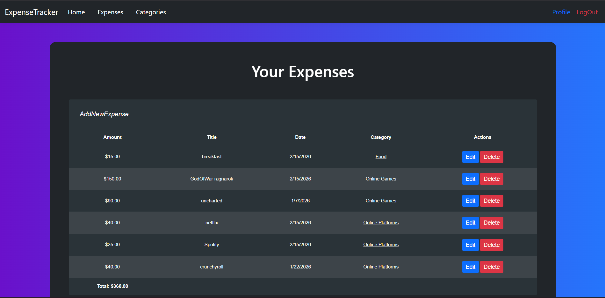
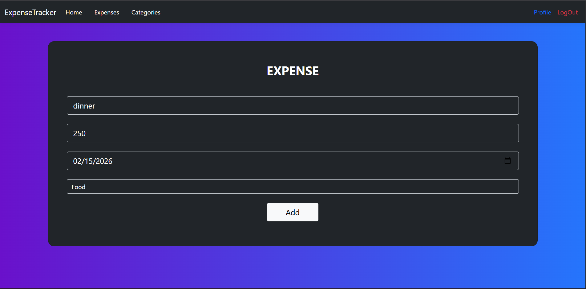
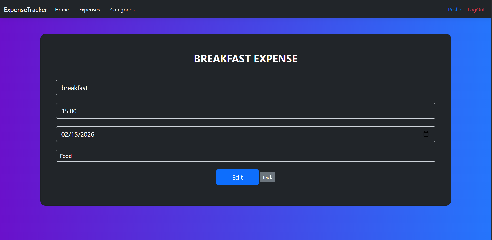
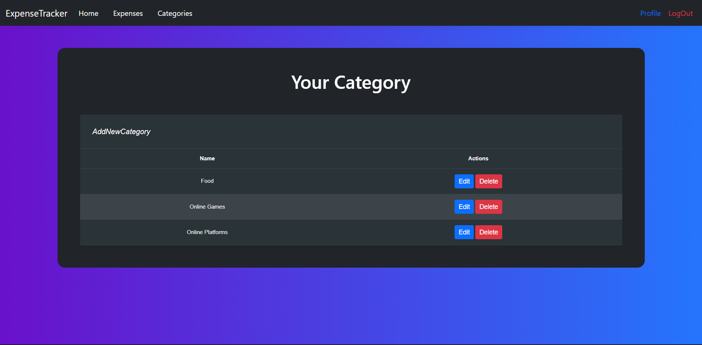
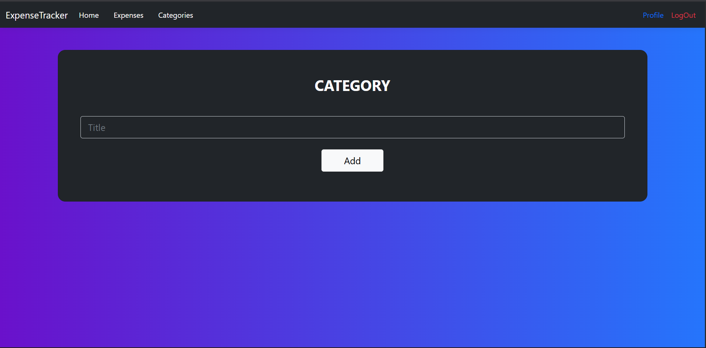
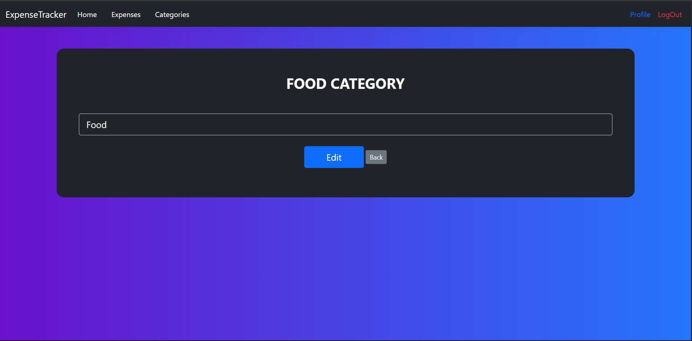

# 💰 Expense Tracker


A full-featured **Expense Tracker** web application built with **ASP.NET Core MVC** and a clean **3-Tier Architecture**. Track your daily expenses, organize them by categories, and visualize your spending through an interactive dashboard — all secured with cookie-based authentication.

---

## 📋 Table of Contents

- [Project Overview](#-project-overview)
- [Features](#-features)
- [Architecture](#-architecture)
- [Vertical Slice Design](#-vertical-slice-design)
- [Technologies Used](#-technologies-used)
- [How to Run the Project](#-how-to-run-the-project)
- [Screenshots](#-screenshots)
- [Future Improvements](#-future-improvements)

---

## 🔍 Project Overview

Expense Tracker is a web application that allows users to manage their personal finances efficiently. Users can register, log in, create expense categories, record expenses, and view insightful statistics on a dashboard. The project follows software engineering best practices including separation of concerns, the repository pattern with Unit of Work, and dependency injection.

---

## ✨ Features

- 🔐 **User Authentication** — Secure register and login with cookie-based authentication and BCrypt password hashing
- 💸 **Expense Management** — Full CRUD operations for tracking expenses with amount, date, description, and category
- 🏷️ **Category Management** — Full CRUD operations for organizing expenses into custom categories
- 📊 **Dashboard** — Visual statistics and charts summarizing spending habits
- 🎨 **Clean UI** — Responsive and modern user interface with enhanced styling
- 🔒 **Authorization** — Protected routes ensuring only authenticated users can access the application

---

## 🏗️ Architecture

The project follows the **3-Tier Architecture** pattern, ensuring a clean separation of concerns across three distinct layers:

```
┌─────────────────────────────────────────────────┐
│              Presentation Layer                 │
│   (ASP.NET Core MVC — Controllers & Views)      │
│   Models · Controllers · Views · Program.cs     │
├─────────────────────────────────────────────────┤
│            Business Logic Layer                 │
│   (Services · Interfaces · DTOs · Mapping)      │
│   AuthService · ExpenseService · CategoryService│
│   DashboardService · AutoMapper Profiles        │
├─────────────────────────────────────────────────┤
│             Data Access Layer                   │
│   (EF Core · DbContext · Configurations)        │
│   Models · Migrations · Entity Configurations   │
└─────────────────────────────────────────────────┘
               ▼
        🗄️ SQL Server Database
```

| Layer | Project | Responsibility |
|---|---|---|
| **Presentation** | `PresentationLayer` | Handles HTTP requests, renders views, and manages user interaction through ASP.NET Core MVC controllers and Razor views. |
| **Business Logic** | `BusinessLogicLayer` | Contains application services, interfaces, DTOs, and mapping profiles. Implements core business rules and orchestrates data flow between the Presentation and Data Access layers. |
| **Data Access** | `DataAccessLayer` | Manages database operations using Entity Framework Core. Contains the `DbContext`, entity models, Fluent API configurations, and migrations. |

**Key Design Patterns:**
- **Repository Pattern** with Generic Repository for reusable data access logic
- **Unit of Work** to coordinate multiple repository operations within a single transaction
- **Dependency Injection** for loose coupling across all layers
- **DTO Pattern** to decouple domain models from view models

---

## 🧩 Vertical Slice Design

The project was developed using a **Vertical Slice** approach, where each feature was built end-to-end across all architectural layers before moving to the next:

| Slice | Feature | Description |
|---|---|---|
| **Slice 1** | 🔐 Authentication | User registration and login with cookie authentication and BCrypt password hashing |
| **Slice 2** | 💸 Expenses CRUD | Create, read, update, and delete expenses linked to user accounts and categories |
| **Slice 3** | 🏷️ Categories CRUD | Create, read, update, and delete custom expense categories per user |
| **Slice 4** | 🎨 UI Enhancements | Improved layouts, styling, and overall user experience |
| **Slice 5** | 📊 Dashboard | Statistics overview with charts visualizing expenses by category and spending trends |

Each slice delivered a fully functional, independently testable feature — from the database schema through the service layer to the user interface.

---

## 🛠️ Technologies Used

| Technology | Purpose |
|---|---|
| **ASP.NET Core 8 MVC** | Web framework for building the application |
| **Entity Framework Core 8** | ORM for database access and migrations |
| **SQL Server** | Relational database for data persistence |
| **Cookie Authentication** | Secure session-based user authentication |
| **BCrypt.Net** | Password hashing for secure credential storage |
| **AutoMapper** | Object-to-object mapping between entities and DTOs |
| **Razor Views** | Server-side HTML rendering with C# |
| **Bootstrap** | Responsive front-end styling |
| **C# 12** | Primary programming language |

---

## 🚀 How to Run the Project

### Prerequisites

- [.NET 8 SDK](https://dotnet.microsoft.com/download/dotnet/8.0)
- [SQL Server](https://www.microsoft.com/en-us/sql-server/sql-server-downloads) (LocalDB, Express, or full edition)
- [Visual Studio 2022](https://visualstudio.microsoft.com/) (recommended) or any compatible IDE

### Steps

1. **Clone the repository**
   ```bash
   git clone https://github.com/KamalElsayedJR/ExpenseTracker.git
   cd ExpenseTracker
   ```

2. **Configure the database connection**

   Open `PresentationLayer/appsettings.json` and update the `DefaultConnection` string to point to your SQL Server instance:
   ```json
   "ConnectionStrings": {
     "DefaultConnection": "Server=YOUR_SERVER;Database=ExpenseTrackerDb;Trusted_Connection=True;TrustServerCertificate=True;"
   }
   ```

3. **Apply database migrations**
   ```bash
   cd DataAccessLayer
   dotnet ef database update --startup-project ../PresentationLayer
   ```

4. **Run the application**
   ```bash
   cd ../PresentationLayer
   dotnet run
   ```

5. **Open in browser**

   Navigate to `https://localhost:5001` or the URL displayed in the terminal.

---

## 📸 Screenshots

### 🔐 Authentication

| Register | Login |
|---|---|
|  |  |

### 📊 Dashboard



### 💸 Expenses

| Your Expenses | New Expense | Edit Expense |
|---|---|---|
|  |  |  |

### 🏷️ Categories

| Your Categories | New Category | Edit Category |
|---|---|---|
|  |  |  |

---

## 🔮 Future Improvements

- 📱 **Responsive Mobile Design** — Further optimize the UI for mobile devices
- 📤 **Export to CSV/PDF** — Allow users to export their expense data
- 📅 **Date Range Filtering** — Filter expenses and dashboard data by custom date ranges
- 🏦 **Budget Limits** — Set monthly budget limits with alerts when approaching the threshold
- 🔔 **Notifications** — Email or in-app reminders for recurring expenses
- 🌐 **REST API Layer** — Expose endpoints for potential mobile or third-party integrations
- 🧪 **Unit & Integration Tests** — Add comprehensive test coverage across all layers
- 🐳 **Docker Support** — Containerize the application for streamlined deployment
- ☁️ **Cloud Deployment** — Deploy to Azure App Service with Azure SQL Database

---

## 📄 License

This project is open source and available for learning and portfolio purposes.

---

> Built with ❤️ by [Kamal Elsayed](https://github.com/KamalElsayedJR)
